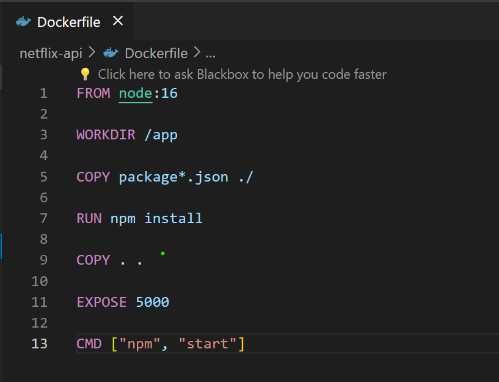

# Cloud Computing

# 21BCP421 G-12 , Div-6 , Sem-6

## Problem Statement:

Create any three-tier application using Docker, using a multi-container setup. Build at least one docker image using Dockerfile. You are free to use your old projects, build new projects or take any project from GitHub. However, if you are using a project from Github, properly cite the original author of the code in your blog.

## Steps

Hey everyone, In this blog post we will be deploying a full stack web application using Docker. The application will be split into three microservices.

1. Frontend Container of ReactJs
2. Backend Container of NodeJs
3. Database Container of MongoDB
Before we start with the deployment, let’s understand what Docker is and why we need it. Docker is a platform that allows you to develop, test, and deploy applications in containers. Containers are lightweight, standalone, and executable packages of software that include everything needed to run an application: code, runtime, system tools, system libraries, and settings. Containers are isolated from each other and from the underlying host, which means that they can run the same application on different environments without any changes. This makes it easy to deploy applications in a consistent and reproducible way.

Docker also provides tools for managing containers, such as Docker Compose, which allows you to define and run multi-container applications. In this blog, we will be using Docker Compose to define and run our full stack web application. Let’s start

1. Create a full stack application or use an existing one built on ReactJs, NodeJs and MongoDB.
   
I have used an application of my own which you can clone from Stock Suggestion App or use any existing application you have. Just make sure it has the same tech-stack.

This is the file structure of our application:
  

2. Create a repository on Docker Hub to store your Docker images.
Go to Docker Hub and create a new repository to store your Docker images. You can create a public or private repository depending on your requirements. Once you have created the repository, note down the repository name as we will need it later to push our Docker images to the repository.

This is what your repository should look like
 

 3. Create a Dockerfile for each of the services.
Dockerfile is a text file that contains a set of instructions that are used to build a Docker image. The Docker image is a lightweight, standalone, and executable package of software that includes everything needed to run an application. The Dockerfile contains instructions to build the image, such as the base image, working directory, dependencies, and commands to run the application.

3.1 Dockerfile for ReactJs server at path client/Dockerfile

Before creating the Dockerfile for the ReactJs server, make sure you have a build script in your package.json file. 
   1. Now, change your current working directory to client
   2. create a Dockerfile in the client folder

This is what your final Dockerfile should look like:
      

Now we will build the Docker image from the created Dockerfile and push it to the Docker Hub repository, follow the below steps carefully

Build the Docker image using the following command:
      

      
       
Replace <DockerHubUsername> with your Docker Hub username and <RepositoryName> with the repository name of the created repository in step 2.

This command will build the Docker image for the ReactJs server using the Dockerfile in the client folder.

Lets check if the image is created successfully by running the following command:
      
      
This command will list all the Docker images on your system. You should see the Docker image for the ReactJs server in the list.

   1. Now we will see if the image is running successfully by running the          following command:
       

       

       
This command will run the Docker image for the ReactJs server on port 3000. You should be able to access the ReactJs server at http://localhost:3000.

   1. Push the Docker image to the Docker Hub repository using the following command:
      
      
This command will push the Docker image to the Docker Hub repository. You can check the Docker Hub repository to see if the image has been pushed successfully.
       

3.2 Creating Dockerfile for NodeJs server

   1. Now, change your current working directory to client
      
   2. Create a Dockerfile in the client folder
      
This is what your final Dockerfile should look like:
        
        
Now we will build the Docker image from the created Dockerfile for the server and push it to the Docker Hub repository, follow the below steps carefully

- Build the Docker image using the following command:
   
   

Replace <DockerHubUsername> with your Docker Hub username and <RepositoryName> with the repository name of the created repository in step 2.

This command will build the Docker image for the Nodejs server using the Dockerfile in your local repository.

Note: We will not run the server image as it requires a connection to the MongoDB database. We will run the server image after creating the MongoDB image.

 - Push the Docker image to the Docker Hub repository using the following 
   command:
   
   
This command will push the Docker image to the Docker Hub repository. You can check the Docker Hub repository to see if the image has been pushed successfully.
   

Now we have our client and server images pushed to the Docker Hub repository and ready to run. We now will pull an already created MongoDB image from the Docker Hub and run it.

3.3 Pulling MongoDB image from Docker Hub

Pull the MongoDB image from the Docker Hub using the following command:

   
   
   

4. Run our application with the created docker imagesPermalink
Now that we have all our images ready, we can run our application by running all the docker containers and exposing the ports on which they will run so all three microservices can communicate with each other.

Follow the below commands to run your containers:
     
     

Now that we have created the containers, we need to create a network that we will connect to the server and the mongo container. We will do this so that we can get the IP of the mongo container and use it in the connection string as mongoose.connect('mongodb:<CONTAINER_IP>:27017:<DB_NAME>')

This is how your create a docker network:
     

Now you attach this network to the mongodb container: docker network connect <NETWORK_NAME> <CONTAINER_ID>
      

You can get the container IP using docker inspect <CONTAINER_NAME>
      

After this, use this container IP or container ID in the the mongoose connection string and build your server image and run it again. Attach the network to the server container too to allow communication between server and database. Note: You do not have to connect the network to the client container
      
      
      

Once all the containers are up and running, you can test the app at http://localhost:3000

This is how the website will look like:

      
      
      

We have successfully deployed our three-tier MERN stack application with docker!

Conclusion:
By containerizing your MERN stack application with Docker and leveraging Docker networks, you’ve achieved a portable, efficient, and scalable development environment. This approach streamlines development workflows, simplifies collaboration, and paves the way for seamless deployment to production.

Remember, this is just the beginning! Explore further optimizations for production environments, such as volume management for persistent data storage and integrating with container orchestration tools like Kubernetes. As your MERN application grows, Docker will continue to be a valuable asset in your development toolbox.
